# 基础知识

## 基础分布:star:

**泊松分布**：$P(X=k)=\frac{e^{-\lambda}\lambda^k}{k!}$，其**期望**和**方差**均为$\lambda$。

**二项分布**：$P\{X=k\}=C_n^kp^k(1-p)^{n-k}$，$C_n^k=\frac{n!}{k!(n-k)!}$。其**期望**为$np$，**方差**为$np(1-p)$。

**指数分布**：其概率密度函数为$f(x)=\lambda e^{-\lambda x}，x>0$，否则为0。其**期望**为$1/\lambda$，**方差**为$1/\lambda^2$。

**正态分布**：其概率密度函数为$f(x)=\frac{1}{\sqrt{2\pi\sigma^2}}\exp{-\frac{(x-u)^2}{2\sigma^2}}$。其**期望**为$\mu$，**方差**为$\sigma^2$。

- 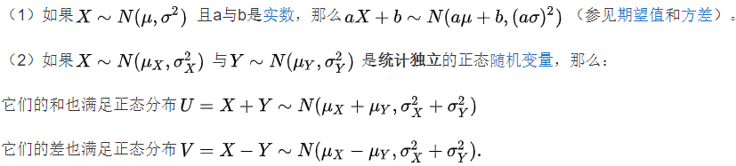

### 总体、样本、统计模型

总体：研究对象的总体。通常用X、Y表示

个体：总体中的每个对象。

样本：$X_1,X_2,...,X_n$。样本的实现称为样本的一组观察值

### 联合分布函数

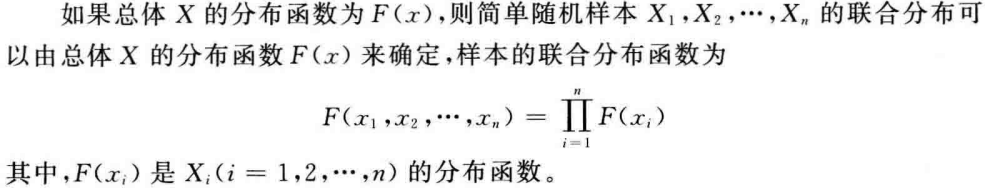

### 总体分布族

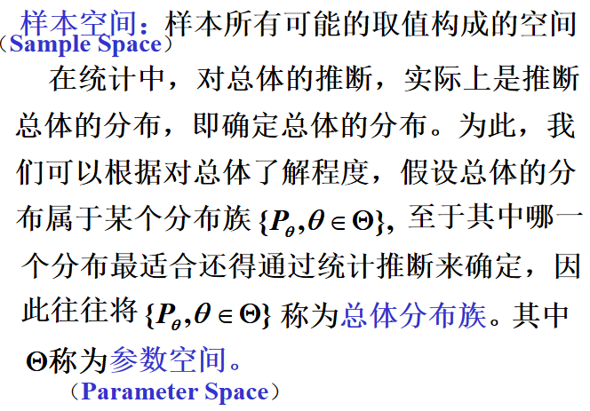

### 	统计量和充分统计量

**统计量**：不包含未知参数的样本函数，称为统计量。常见统计量如下：

- **样本均值** $\overline{X}=\frac{1}{n}\sum_{i=1}^nX_i$，描述了样本的集中取值趋势。
- **均方差** $S^2=\frac{1}{n-1}\sum_{i=1}^n(X_i-\overline{X})^2$，描述了样本取址的分散程度大小。
- **k阶原点矩** $A_k=\frac{1}{n}\sum_{i=1}^nX_i^k$。
- **k阶中心矩** $B_k=\frac{1}{n}\sum_{i=1}^n(X_i-\overline{X})^k$。

*一些性质*：

- $Var(\overline{X})=\frac{1}{n}Var(X)$
- $E(S^2)=Var(X)$
- $E(X^2)=Var(X)+[E(X)]^ 2$

**充分统计量**：在给定$T(X)=t$的条件下，X的条件分布与参数$\theta$无关，则$T(X)$是参数$\theta$充分统计量。

:star: :star: :star:使用**因子分解定理**来证明统计量的**充分性**：

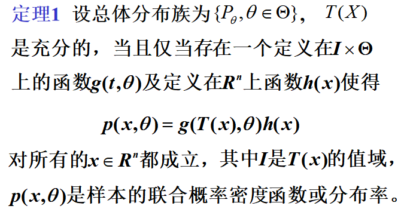

### 抽样分布

统计量的分布为抽样分布。

#### 特征函数

设X为随机变量，称函数$\phi(t)=E(e^{itX})$，为X的**特征函数**。常见分布的特征函数：

- **二项分布**B(n,p)：$\phi(t)=(pe^{it}+(1-p))^n$
- **泊松分布**：$\phi(t)=exp\{\lambda(e^{it}-1)\}$
- **正态分布**：$\phi(t)=exp\{iut-1/2\sigma^2t^2\}$

**其性质**：

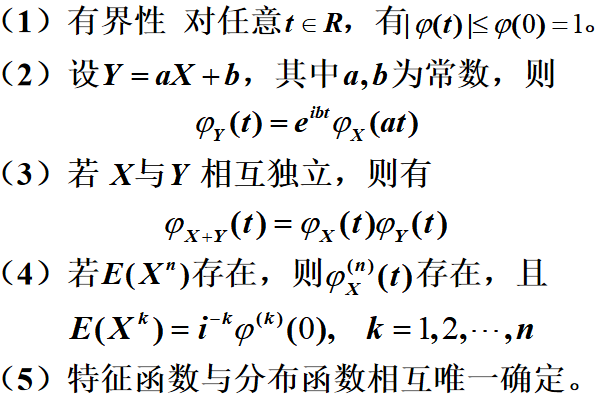

### 三大分布:star:

#### $\chi^2$分布

设随机变量$X_1,X_2,...,X_n$相互独立，且同服从标准正态分布$N(0,1)$，称随机变量$\chi^2=X_1^2+X_2^2+\cdots+X_n^2$，所服从的分布，为自由度是n的**$\chi^2$-分布**，记为$\chi^2-\chi^2(n)$

如果正态分布为$N(\mu,\sigma^2)$，则有$\chi^2=\frac{1}{\sigma^2}\sum_{i=1}^n(X_i-\mu) \approx \chi^2(n)$

此分布的**特征函数**为：$\phi(t)=E(e^{itx})=(1-2it)^{\frac{n}{2}}$。

$E(X)=n,D(X)=2n$

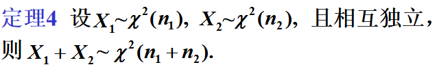

#### t-分布

设随机变量X服从$N(0,1)$，Y服从$\chi^2(n)$，且X与Y相互独立，则称随机变量：
$$
T=X/\sqrt{Y/n}
$$
所服从的分布是自由度为n的**t-分布**，记为$T-t(n)$。

#### F-分布

设随机变量X服从$\chi^2(n_1)$，Y服从$\chi^2(n_2)$，且X和Y相互独立，则称随机变量
$$
F=\frac{X}{n_1}/\frac{Y}{n_2}
$$
所服从的分布为自由度是$n_1$，$n_2$的**F-分布**，记为$F-F(n_1,n_2)$。

### 正态统计下常用统计量的分布:star:

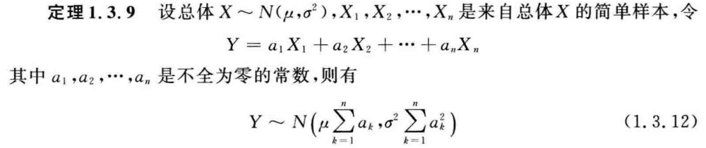

:star::star::star:设$X_1,X_2,\cdots,X_n$是来自正态总体$N(\mu,\sigma^2)$的一个简单样本，则：

- $\overline{X}$服从$N(\mu,\sigma^2/n)$
- $\overline{X}$和$S^2$相互独立
- $(n-1)S^2/\sigma^2$服从$\chi^2(n-1)$
- $n(\overline{x}-\mu_0)^2/\sigma^2$服从$\chi^2(1)$
- $t^2$服从$F(1,n)$

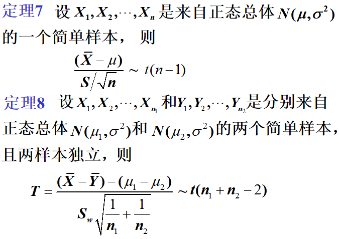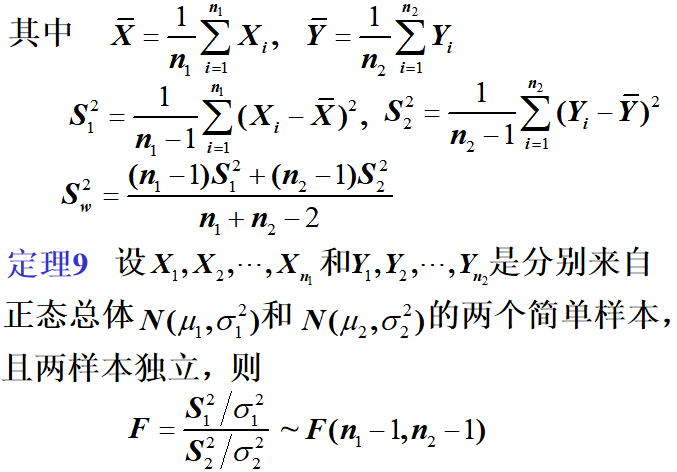

### 分位数

设随机变量X的分布函数为F(x)，对任意给定的实数p $(0<p<1)$，若存在$ x_p$使得：
$$
P\{X\leq x_p\}=F(x_p)=p
$$
成立，则称$x_p$为**此概率分布的p分位点**。

常见的分布分位点记号：

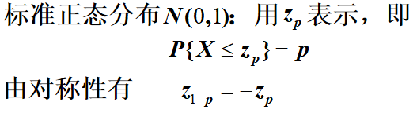

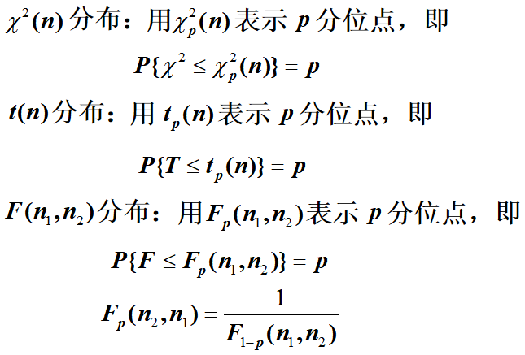