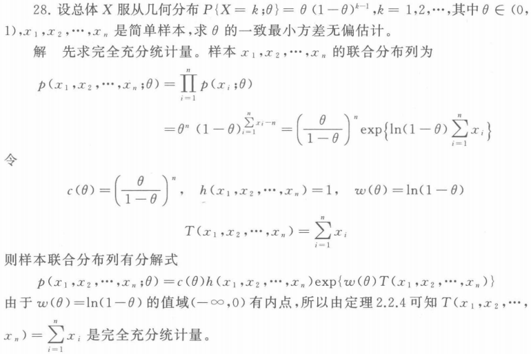

[toc]

# 参数估计

**统计推断**，即从样本来推断总体的分布或所感兴趣的总体特征数，分为**参数估计**和**假设检验**。

### 频率替换法

**个人理解**：我们怎么估计目标函数呢？例如，对于二项分布，其期望值为np，对于它的估计，我们可以通过实际采样得到的概率**p帽**来进行替代估计。

### 矩估计法:star:

这个方法基于**替换原理**。由**大数定理**可知，若总体矩存在，则**样本矩**依概率几乎**必然收敛**于相应的**总体矩**。这说明只要总体矩存在，就可以用相应的样本矩作为总体矩的**合理估计**，进而求出参数的估计。

个人理解，这个和上一个类似，不过不是直接使用采样得到的频率进行替换，而是对于目标参数，使用**总体矩**进行表示，然后将这个总体矩，替换成**样本矩**。

### 极大似然法:star::star:

**极大似然估计法**基于这样一个原理：在一次实验中，某一事件已经发生，则必认为发生该事件的概率最大（**小概率事件原理**）。

具体怎么求呢？考虑如下情况：

- 当参数空间仅包含有限元使，可以是**穷举法**。

- 如果包含的是一个域，则可对$L(\theta,x)$取对数，然后令偏导导数为0，即：

    

求得参数$\theta$的极大似然估计，将其带入$q(\theta)$，就可以获得**此函数的极大似然估计**。

直接记吧:star::star:：

- 对于正态分布$N(\mu,\sigma^2)$，**期望**的极大似然估计为$\overline{x}$，方差的为$\frac{1}{n}\sum_{i=1}^n(x_i-\overline{x})^2$
- **:star:值得注意的是**，如果似然函数的偏导数**不可能等于0**，此时则无需求对数，而是直接观察，参数取何值时，似然函数最大，然后这个值就是参数的**极大似然估计**。
- **注意11题**。

# 估计量的优良性准则

### 均方误差准则

假设用$T(x)$作为参数$q(\theta)$的估计量，评估估计优劣的一个自然准则可定义如下：
$$
MES_{\theta}(T)=R(\theta,T)=E(T(x)-q(\theta))^2
$$
称上式为**均方误差**，简记为**MSE**，如果$R(\theta,T)<+\infin$，则MSE由T的均值和方差确定，即：
$$
R(\theta,T)=Var_{\theta}(T(x))+b^2(\theta,T),\quad b(\theta,T)=E_{\theta}(T(x)-q(\theta))
$$
称b为估计产生的偏差。

设$S(x)$和$T(x)$是参数$q(\theta)$的两个估计，如果对所有$\theta\in\Theta$，不等式$R(\theta,T)\leq R(\theta,S)$成立，且对某些$\theta$严格不等式成立，则称T比S好，也说S是**非容许的**。

### 无偏性

均方误差一致达到最小的最优估计并不存在，由此考虑**无偏性**。

如果对所有的$\theta\in\Theta$，有：
$$
E_\theta(T(X))=q(\theta)
$$
成立，即$b(\theta,T)=0$，则称T(X)是参数$q(\theta)$的**无偏估计量**。

+ 对于正态分布$N(\mu,\sigma^2)$，**期望**的极大似然估计为$\overline{x}$，方差的为$\frac{1}{n}\sum_{i=1}^n(x_i-\overline{x})^2$。这两者都是**无偏的**。

那么在无偏估计的条件下，最好的无偏估计是否存在。

### 一致最小方差无偏估计

如果存在无偏估计$T(x)\in U_q$，使得对任意的$S(x)\in U_q$，有
$$
Var_\theta(T(x))\leq Var_\theta(S(x))
$$
对所有的$\theta \in \Theta$都成立，则称T(x)为$q(\theta)$的**一致最小方差无偏估计**。简称为**UMVUE**

定理**4.3**	设统计模型为$\{P_\theta,\theta \in \Theta\}$，S(x)是其充分统计量，$\phi(x)$是$q(\theta)$的无偏估计量，令
$$
T(x)=E(\phi(x)|S(x))，
$$
则T(x)也是$q(\theta)$的无偏估计量，且对所有的$\theta \in \Theta$，有
$$
Var_\theta(T(x)\leq Var_\theta(\phi(x)))
$$
由此定理可知，利用充分统计量可以降低无偏估计量的方差。因此，为了寻找UMVUE，可以通过取充分统计量的条件期望（它是充分统计量的函数且是无偏的）来缩小无偏估计类。

### 完全性

为了在概率意义下确定唯一性，还需对统计量提出合理的要求，这便是统计量的完全性。

设g(t)是定义在统计量T(x)的值域上的任意实值函数，如果对所有的$\theta \in \Theta$，$E_\theta(g(T))=0$成立时，必成立g(T)=0，则称统计量T(x)是**完全的**。

例如：

### 一致最小方差无偏估计（续）

设S(x)是完全充分统计量，$\phi(x)$是$q(\theta)$的无偏估计，则$T(x)=E_\theta(\phi(x)|S(x))$是**UMVUE**，进一步，如果对所有$\theta \in \Theta$，$Var_\theta(T(x))<\infin$，则T(x)是$q(\theta)$唯一的**UMVUE**。

+ 对于正态分布来说，无论$\sigma^2$是否已知，$\overline{x}$都是$\mu$的**UMVUE**；
+ 对于正态分布来说，当$\mu$未知时，$\sigma^2$的UMVUE为样本方差$S^2=\frac{1}{n-1}(\sum_{i=1}^nx_i^2-n\overline{x}^2)$；而当$\mu$已知时，$S^2$不是$\sigma^2$的**UMVUE**。
+ 设总体X在$[0,\theta]$上服从均匀分布，则$\theta$的**UMVUE**为$\frac{n+1}{n}x_{(n)}$

### 信息不等式

对于$q(\theta)$的无偏估计类$U_q$，在一定的条件下，

+ 既然无偏估计的方差不是零，则必存在一个下界，这个下界是多少？
+ 若UMVUE存在，那么它的方差是否可以达到这个下界？

### 有效估计

定义**4.6**	设$\{T_n(X)\}$是参数$q(\theta)$估计序列，如果对所有的$\theta \in \Theta$，都有
$$
\lim_{n\rightarrow\infin}{E_\theta(T_n(X))}=q(\theta)
$$
则称$T_n(X)$为参数$q(\theta)$的**渐近无偏估计**。

### 相和估计

