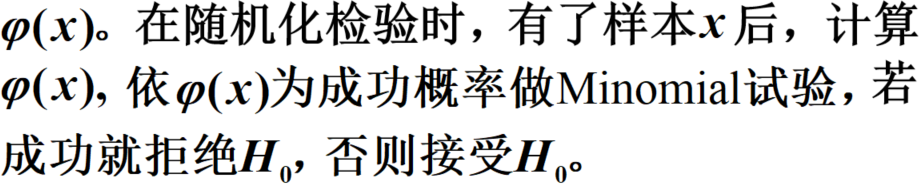
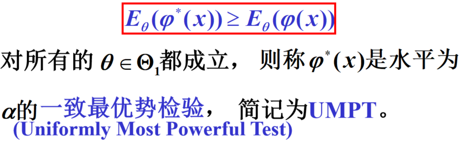
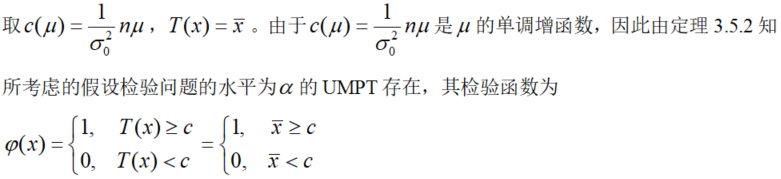

# 假设检验

### Neyman-Pearson假设检验构架

## 似然比检验

### 一般步骤

## 一致最优功效检验

# 考试准备

实在看不懂，暂且应付考试，哈哈哈，以14年的真题为例：

- 题目

1. 首先求联合密度函数，并进行分解

​		分解方式：

2. 然后根据分解结果，设置检验函数，核心是使用$T(x)$作为区间

    

3. 求检验函数的期望，只对值为1的区间进行考虑

    

4. 求得c的值，进行变换，转化为某一个分布，比如这里转化成了正态分布，然后回代，求势函数。此外需要注意的是，咱们带入的是$\mu_o$

    

1. 第二份，求犯错概率。第一步是求得势函数的期望，但和上一步不同，这里的势函数期望考虑的是整个参数域，所以下标要由$\mu_0$变为$\mu$，具体来说，就是消除不等式坐边的$\mu_o$ 。提示还需要转变为上一步所需的分布形式，这里是正态分布

    

2. 求第一类错误的概率，这里就是**势函数期望**

    

3. 第二类，就是1-势函数期望。

    