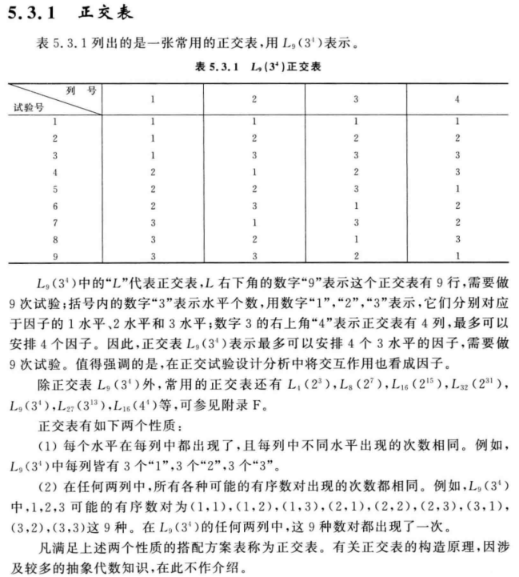
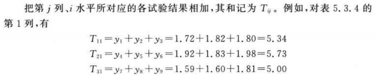
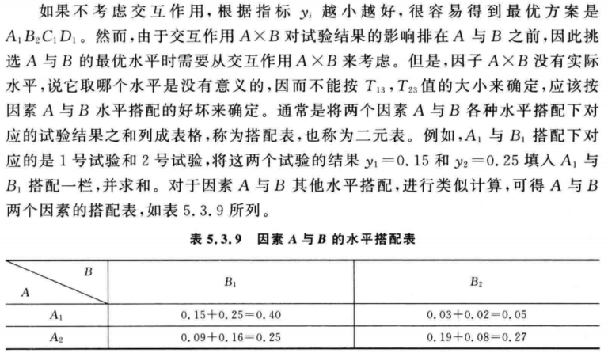
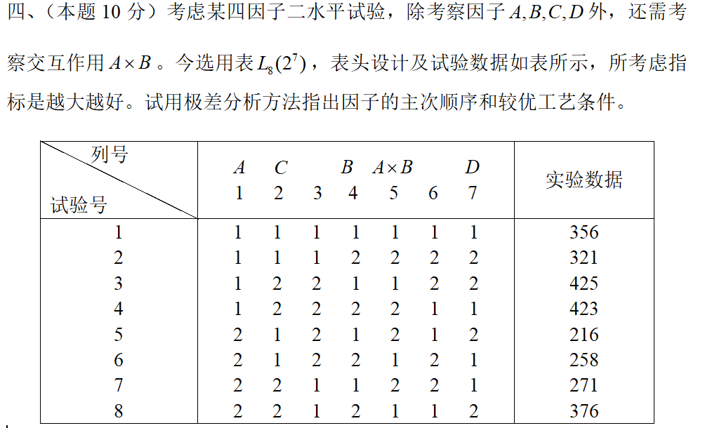
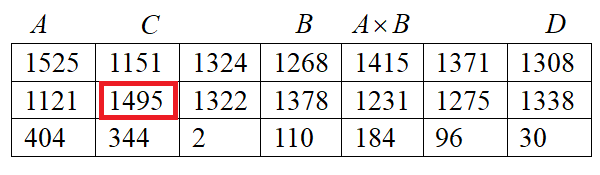
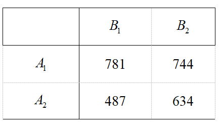
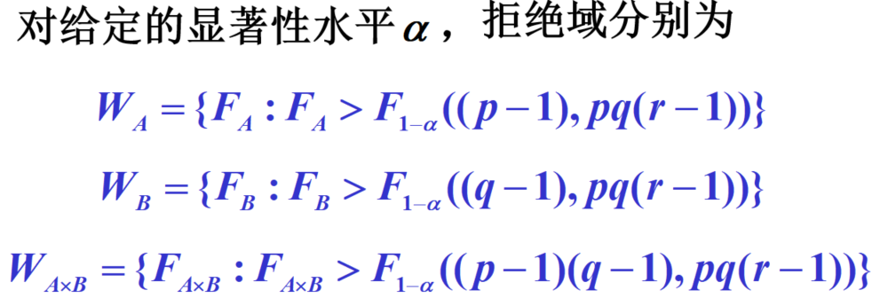
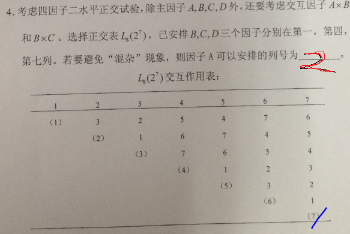

## 这道题应该是送分题！

以15年的真题为例

首先求$T_{ij}$，因为是两个水平，而i是水平数，j是列数，所以每列只有两个T，具体怎么求呢，就是取第j列的i水平对应的实验数据求和，例如：
$$
T_{22}=425+423+271+376=1495
$$

然后，第三行是前两者的差。==主次顺序==则按依据此进行从大到小排序，因此主次顺序为：$A,C,A\times B,B,D$

然后A和B有相互作用，所以需要再建个表

怎么建呢？以<A1,B1>项为例，选取A，B列同时为1的行，其末尾数据相加，也就是：$356+325=781$。

这个时候越小越好，所以选择<A2,B1>，所以较优工艺为 $A_2B_1C_1D_1$。

（原答案错了）

此外，对于填空题

目前，感觉答案要么是$(p-1)(q-1)$，$pq(r-1)$，怎么选呢？看套了几个$\sum$。

